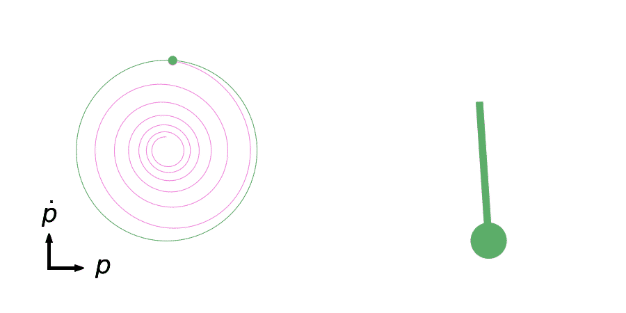

Oscillator simulations
**********************

Tests
=====

Run tests with::

    poetry run pytest --doctest-modules

Video gifs
==========

.. code-block::

    poetry run pendulum -o pendulum@2x.avi
    ffmpeg  -i pendulum@2x.avi -filter_complex \
        "[0:v] split [a][b];[a] palettegen [p];[b][p] paletteuse" \
        pendulum@2x.gif
